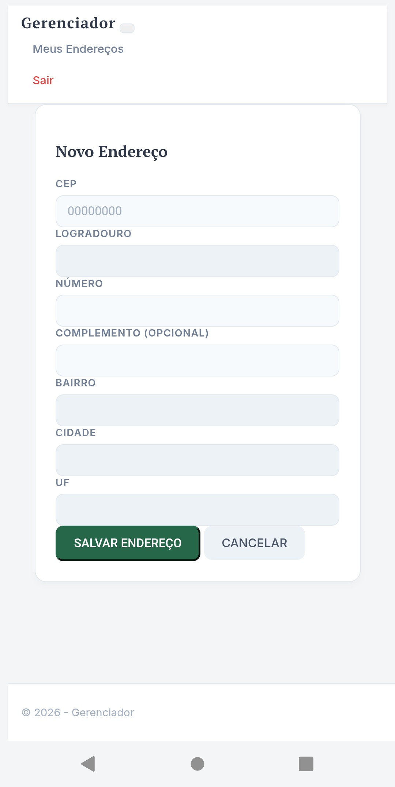

# Gerenciador de Enderecos

Este sistema foi desenvolvido com foco em alta disponibilidade e isolamento de ambiente, utilizando uma arquitetura moderna de containers e proxy reverso.

---

## Demonstracao

### Screenshots do Sistema
1. Tela de Login

2. Cadastro de Usuario

3. Dashboard de Enderecos

4. Cadastro de Novo Endereco

---

## Infraestrutura e Ambiente
* Sistema Operacional: VPS Linux Ubuntu 22.04 LTS
* Containerizacao: Docker e Docker Compose
* Servidor Web e Proxy Reverso: Nginx
* Seguranca e Dominio: Cloudflare (SSL/TLS ponta a ponta)
* Redirecionamento: Regras de Origem (Origin Rules) no Cloudflare para redirecionamento de porta e Proxy Reverso.

---

## Guia de Instalacao (Desenvolvimento)

### 1. Instalacao da estrutura padrao do .NET
Para reconstruir ou iniciar a estrutura MVC dentro da pasta existente, foi utilizado o comando:

dotnet new mvc -n CaseAeC --output .

### 2. Configuracao de Dependencias
Para garantir a persistencia de dados com SQL Server e ferramentas de migracao, instale os pacotes via terminal:

export PATH="$PATH:$HOME/.dotnet/tools"

dotnet add package Microsoft.EntityFrameworkCore.SqlServer --version 8.0.12
dotnet add package Microsoft.EntityFrameworkCore.Design --version 8.0.12

### 3. Migrations e Banco de Dados
Para criar a estrutura inicial do banco de dados:

dotnet ef migrations add InitialCreate

Se o comando acima finalizar sem erros, rode este para criar as tabelas de verdade dentro do container do Docker:

dotnet ef database update

### 4. Variaveis de Ambiente
O sistema utiliza um arquivo .env para gerenciar credenciais sensiveis. Use o arquivo de exemplo para configurar seu ambiente:

cp .env_exemplo .env
# Edite o .env com sua senha do SQL Server

### 5. Orquestracao com Docker
Para subir todo o ecossistema (Aplicacao + Banco de Dados + Nginx), utilize o comando:

docker compose up -d --build

## Configuracao de Rede e Proxy
A arquitetura foi desenhada para que o Nginx receba as requisicoes externas e as direcione internamente para os servicos:
* Porta 8088: Proxy para a aplicacao (HTTP)
* Porta 2053: Proxy seguro (HTTPS)
* API: Mapeamento especifico no Nginx para endpoints /api/ com suporte a CORS.

## Estrutura do Projeto
* Controllers/: Logica de controle das requisicoes.
* Models/: Representacao das entidades e ViewModel de Login.
* Views/: Interfaces Razor para Usuarios e Enderecos.
* Data/: Contexto do banco de dados e configuracoes do EF Core.
* nginx.conf: Configuracoes de roteamento e seguranca do servidor web.
