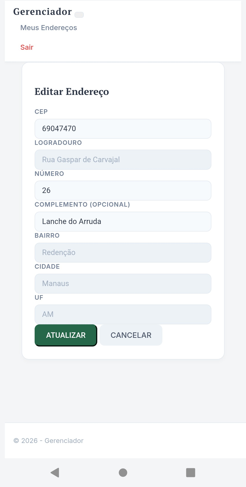

# Gerenciador de Enderecos

Este sistema foi desenvolvido com foco em alta disponibilidade e isolamento de ambiente, utilizando uma arquitetura moderna de containers e proxy reverso.

---

## Demonstracao
https://gerenciador.bycodeai.shop/

### Screenshots do Sistema
1. Tela de Login

2. Cadastro de Usuario

3. Dashboard de Enderecos

4. Cadastro de Novo Endereco

5. Editar Endereco

---

## Infraestrutura e Ambiente
* Sistema Operacional: VPS Linux Ubuntu 22.04 LTS
* Containerizacao: Docker e Docker Compose
* Servidor Web e Proxy Reverso: Nginx
* Seguranca e Dominio: Cloudflare (SSL/TLS ponta a ponta)
* Redirecionamento: Regras de Origem (Origin Rules) no Cloudflare para redirecionamento de porta e Proxy Reverso.

---

## Guia de Instalacao (Desenvolvimento)

### 1. Instalacao da estrutura padrao do .NET
Para reconstruir ou iniciar a estrutura MVC dentro da pasta existente, foi utilizado o comando:

`dotnet new mvc -n Gerenciador --output .`

### 2. Configuracao de Dependencias
Para garantir a persistencia de dados com SQL Server e ferramentas de migracao, instale os pacotes via terminal:

`export PATH="$PATH:$HOME/.dotnet/tools"`

`dotnet add package Microsoft.EntityFrameworkCore.SqlServer --version 8.0.12`
`dotnet add package Microsoft.EntityFrameworkCore.Design --version 8.0.12`

### 3. Migrations e Banco de Dados
Para criar a estrutura inicial do banco de dados:

`dotnet ef migrations add InitialCreate`

Se o comando acima finalizar sem erros, rode este para criar as tabelas de verdade dentro do container do Docker:

`dotnet ef database update`

### 4. Orquestracao com Docker
Para subir todo o ecossistema (Aplicacao + Banco de Dados + Nginx), utilize o comando:

`docker compose up -d --build`

---

## Configuracao de Rede e Proxy
A arquitetura foi desenhada para que o Nginx receba as requisicoes externas e as direcione internamente para os servicos:
* Porta 8084: Proxy para a aplicacao (HTTP)
* Porta 2083: Proxy seguro (HTTPS)
* API: Mapeamento especifico no Nginx para endpoints `/api/` com suporte a CORS.

---

## Estrutura do Projeto

Abaixo está a representação da estrutura de pastas do projeto, baseada no ambiente de desenvolvimento:

* **Diretórios Base da Aplicação MVC:**
  * `Controllers/`: Lógica de controle das requisições.
  * `Models/`: Representação das entidades e ViewModel de Login.
  * `Views/`: Interfaces Razor para Usuários e Endereços.
  * `Data/`: Contexto do banco de dados e configurações do EF Core.
  * `Migrations/`: Arquivos gerados pelo Entity Framework para versionamento e criação do banco.
  * `wwwroot/`: Arquivos estáticos da aplicação (CSS, JS, etc.).

* **Diretórios de Apoio e Sistema:**
  * `bin/`, `obj/` e `Properties/`: Diretórios padrões do .NET gerados durante a compilação.
  * `cdn/`: Gerenciamento de arquivos estáticos ou uploads externos.
  * `sql/`: Scripts soltos e consultas de banco de dados estruturadas.

* **Arquivos Principais (.NET):**
  * `Program.cs`: Ponto de entrada e configuração de serviços da aplicação.
  * `appsettings.json`: Configurações de ambiente, como strings de conexão.
  * `gerenciador.csproj`: Gerenciamento de dependências e configuração do projeto em C#.

* **Infraestrutura e Orquestração (`infra/`):** O projeto conta com um diretório `infra` dedicado à infraestrutura. Dentro das pastas de configuração (como a pasta do `Nginx`), localizam-se:
  * `compose.yml`: Arquivo para subir todo o ambiente de containers (App, Banco, Web Server).
  * `Dockerfile`: Receita de construção da imagem da aplicação.
  * `nginx.conf`: Configurações de roteamento e segurança do servidor web proxy reverso.
  
